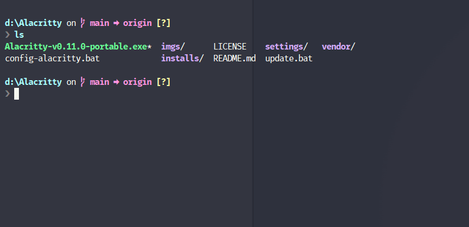

# Alacritty Settings


## Features

<div style="position: relative; width:600px;">
  
  <p style="position: absolute; bottom: 10px; right: 10px; color: white;">Fast access directory</p>
</div>

<div style="position: relative; width:600px;">
  
  <p style="position: absolute; bottom: 10px; right: 10px; color: white;">Fuzz search files</p>
</div>

<div style="position: relative; width:600px;">
  
  <p style="position: absolute; bottom: 10px; right: 10px; color: white;">Command completions</p>
</div>

## Install (quick)

**Windows Setup**

1. clone the repo
1. Run `update.bat`
1. Run `config-alacritty.bat`

FLY!!

**Mac/Linux Setup**

WIP...

## Install (manually)

**Windows Setup**

1. `git clone git@github.com:jwu/alacritty-settings.git ${YOUR_ALACRITTY_PATH}`
1. install [alacritty](https://github.com/alacritty/alacritty/releases) to `${YOUR_ALACRITTY_PATH}`
1. install [FiraMono Nerd Font](https://github.com/ryanoasis/nerd-fonts/releases/download/v2.2.2/FiraMono.zip)
1. copy `${YOUR_ALACRITTY_PATH}/alacrity.default.yml` to `~/AppData/Roaming/alacritty/alacritty.yml`
1. unzip [clink](https://github.com/chrisant996/clink/releases) to `${YOUR_ALACRITTY_PATH}/vendor/clink`
1. unzip [clink-completions](https://github.com/vladimir-kotikov/clink-completions/releases) to `${YOUR_ALACRITTY_PATH}/vendor/clink_completions`
1. unzip [git-for-windows](https://github.com/git-for-windows/git/releases) to `${YOUR_ALACRITTY_PATH}/vendor/git`
1. unzip [starship](https://github.com/starship/starship/releases) to `${YOUR_ALACRITTY_PATH}/vendor`
1. unzip [fzf](https://github.com/junegunn/fzf/releases) to `${YOUR_ALACRITTY_PATH}/vendor/bin`
1. unzip [zoxide](https://github.com/ajeetdsouza/zoxide/releases) to `${YOUR_ALACRITTY_PATH}/vendor/bin`

**Mac/Linux Setup**

WIP...

## Reference

- [alacritty](https://github.com/alacritty/alacritty)
  - [alacritty dracula-color-theme](https://github.com/dracula/alacritty)
  - [nerdfonts](https://www.nerdfonts.com/)
- vendor
  - [clink](https://github.com/chrisant996/clink)
    - [clink-completions](https://github.com/vladimir-kotikov/clink-completions)
    - [clink-fzf](https://github.com/chrisant996/clink-fzf)
    - [clink-zoxide](https://github.com/shunsambongi/clink-zoxide)
  - [starship](https://github.com/starship/starship)
  - [git](https://github.com/git-for-windows/git)
- utils
  - [z](https://github.com/ajeetdsouza/zoxide)
  - [fzf](https://github.com/junegunn/fzf)
    - [sk](https://github.com/lotabout/skim) Windows hasn't support
  - [s](https://github.com/zquestz/s)
  - [fd](https://github.com/sharkdp/fd)
  - [bat](https://github.com/sharkdp/bat)
  - [deno](https://github.com/denoland/deno)
  - [xh](https://github.com/ducaale/xh)
  - [hyperfine](https://github.com/sharkdp/hyperfine)
  - [lsd](https://github.com/Peltoche/lsd)
  - [procs](https://github.com/dalance/procs)
  - [rg](https://github.com/BurntSushi/ripgrep)
  - [jq](https://github.com/stedolan/jq)
  - [btm](https://github.com/ClementTsang/bottom)
  - [grex](https://github.com/pemistahl/grex)
  - [delta](https://github.com/dandavison/delta)
  - [dust](https://github.com/bootandy/dust)
  - [glow](https://github.com/charmbracelet/glow)
  - [navi](https://github.com/denisidoro/navi)
- utils(needs package installer)
  - [fanyi](https://github.com/afc163/fanyi)
- utils(Mac only)
  - [fish](https://fishshell.com/)
  - [ohmyzsh](https://github.com/ohmyzsh/ohmyzsh)
  - [zsh-autosuggestions](https://github.com/zsh-users/zsh-autosuggestions)
- others
  - [warp](https://www.warp.dev/)
  - [nushell](https://github.com/nushell/nushell)
  - [cmder](https://github.com/cmderdev/cmder)
  - [ConEmu](https://github.com/Maximus5/ConEmu)
  - [zellij](https://zellij.dev/)

## Some helpful configs or commands

### set default shell on `*nix` platofrom

```shell
# set zsh as default shell
sudo chsh -s /bin/zsh

# set fish as default shell
sudo chsh -s /usr/local/bin/fish
```

### ~/.alacritty.yml

```yml
import:
  - e:\Alacritty\settings\alacritty.yml

shell:
  program: cmd.exe
  args:
    - /s /k "e:\Alacritty\settings\init.bat"
```

### ~/.zshrc

```zsh
export PATH=$HOME/bin:/usr/local/bin:$PATH
export ZSH=$HOME/.oh-my-zsh
export LANG=en_US.UTF-8
export STARSHIP_CONFIG=$HOME/jwu/alacritty-settings/settings.mac/starship.toml

ZSH_THEME="dracula"

plugins=(
  git
  zsh-autosuggestions
)

source $ZSH/oh-my-zsh.sh
eval "$(starship init zsh)"
eval "$(zoxide init zsh)"
```

### ~/.config/fish/config.fish

```fish
set -x PATH $HOME/bin $HOME/.cargo/bin /usr/local/bin $PATH
set -x LANG "en_US.UTF-8"
set -x STARSHIP_CONFIG "$HOME/jwu/alacritty-settings/settings.mac/starship.toml"

starship init fish | source
zoxide init fish | source
```
