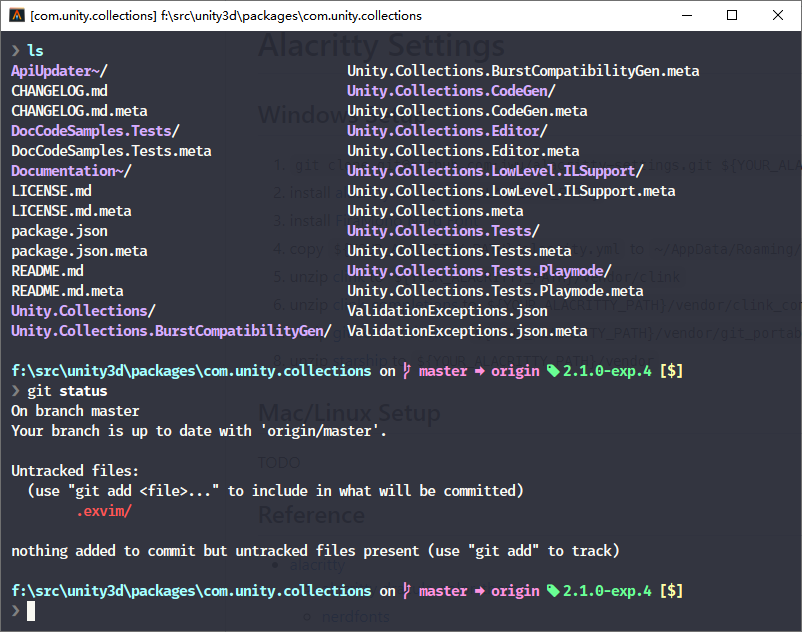

# Alacritty Settings

## Windows Setup

1. `git clone git@github.com:jwu/alacritty-settings.git ${YOUR_ALACRITTY_PATH}`
1. install [alacritty](https://github.com/alacritty/alacritty/releases) to `${YOUR_ALACRITTY_PATH}`
1. install [FiraMono Nerd Font](https://github.com/ryanoasis/nerd-fonts/releases/download/v2.2.2/FiraMono.zip)
1. copy `${YOUR_ALACRITTY_PATH}/alacrity.yml` to `~/AppData/Roaming/alacritty/alacritty.yml`
1. unzip [clink](https://github.com/chrisant996/clink/releases) to `${YOUR_ALACRITTY_PATH}/vendor/clink`
1. unzip [clink-completions](https://github.com/vladimir-kotikov/clink-completions/releases) to `${YOUR_ALACRITTY_PATH}/vendor/clink_completions`
1. unzip [git-for-windows](https://github.com/git-for-windows/git/releases) to `${YOUR_ALACRITTY_PATH}/vendor/git_portable`
1. unzip [starship](https://github.com/starship/starship/releases) to `${YOUR_ALACRITTY_PATH}/vendor`

## Mac/Linux Setup

TODO

## Reference

- [alacritty](https://github.com/alacritty/alacritty)
  - [alacritty dracula-color-theme](https://github.com/dracula/alacritty)
  - [nerdfonts](https://www.nerdfonts.com/)
- [clink](https://github.com/chrisant996/clink)
  - [clink-completions](https://github.com/vladimir-kotikov/clink-completions)
  - [clink-fzf](https://github.com/chrisant996/clink-fzf)
  - [clink-zoxide](https://github.com/shunsambongi/clink-zoxide)
- [starship](https://github.com/starship/starship)
- utils
  - [git](https://github.com/git-for-windows/git)
  - [z](https://github.com/ajeetdsouza/zoxide)
  - [fzf](https://github.com/junegunn/fzf)
  - [fd](https://github.com/sharkdp/fd)
  - [bat](https://github.com/sharkdp/bat)
  - [s](https://github.com/zquestz/s)
  - [hyperfine](https://github.com/sharkdp/hyperfine)
  - [lsd](https://github.com/Peltoche/lsd)
  - [procs](https://github.com/dalance/procs)
  - [rg](https://github.com/BurntSushi/ripgrep)
  - [btm](https://github.com/ClementTsang/bottom)
  - [grex](https://github.com/pemistahl/grex)
  - [delta](https://github.com/dandavison/delta)
  - [dust](https://github.com/bootandy/dust)
  - [navi](https://github.com/denisidoro/navi)
  - [glow](https://github.com/charmbracelet/glow)

## Other Project

- [warp](https://www.warp.dev/)
- [nushell](https://github.com/nushell/nushell)
- [cmder](https://github.com/cmderdev/cmder)
- [ConEmu](https://github.com/Maximus5/ConEmu)
- [zellij](https://zellij.dev/)
